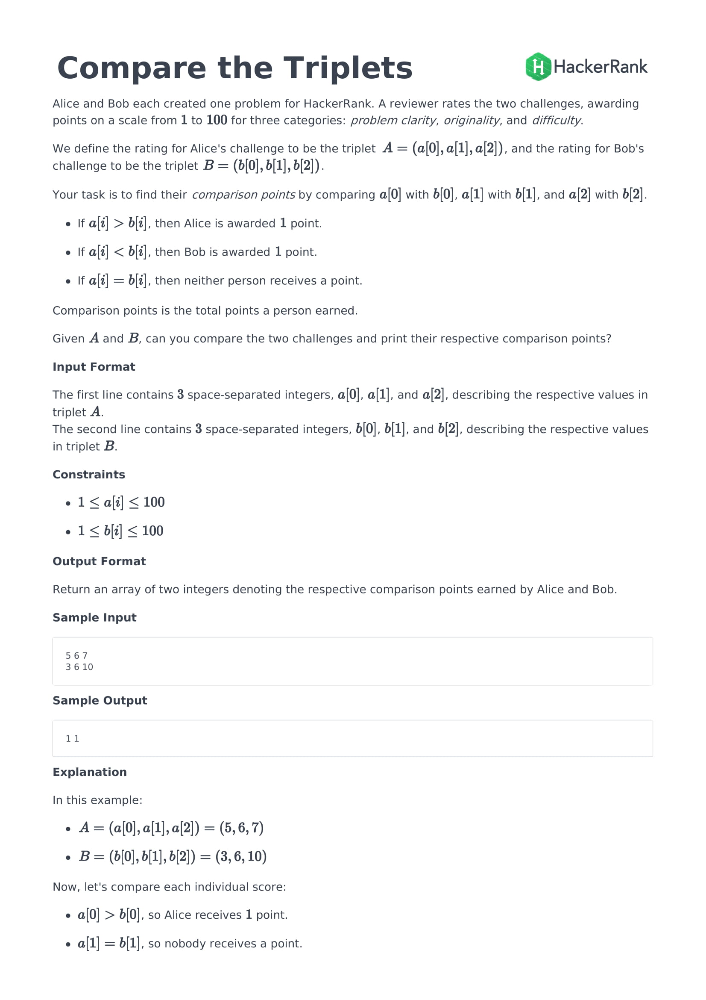

### answer

```python
def solve(a, b):
    a_score= 0
    b_score = 0 
    for i in range(3):
        if a[i] > b[i]:
            a_score += 1
        elif a[i] < b[i]:
            b_score += 1
    return [a_score, b_score]
```

zip함수를 사용해서 두개의 리스트의 아이템들을 for문에서 한번에 꺼낼 수 있다.
```python
def solve(a, b):
    a_score= 0
    b_score = 0 
    for a_item, b_item in zip(a, b):
        if a_item > b_item:
            a_score += 1
        elif a_item < b_item:
            b_score += 1
    return [a_score, b_score]
```
점프투파이썬의 python내장함수 zip에 대한 설명 [링크](https://wikidocs.net/32#zip)
