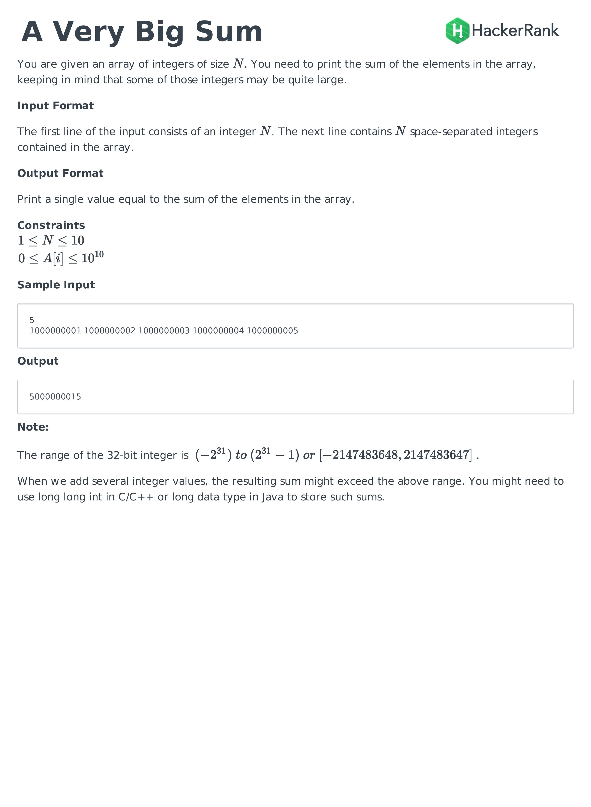

### answer

```python
def aVeryBigSum(ar):
    return sum(ar)
```
사실 너무나 간단한 문제여서 적지 않을려고 했는데 파이썬을 사용하는데에 있어서 
디테일한 부분에 있어서 기록해야 될 것이 있어서 이렇게 기록을 남기게 되었다.

python 자료형 중 int의 하나의 크기는 얼마나 될까

`처음시작하는 파이썬`이라는 책에 나온 내용을 소개하자면
> python2 에서 int의 크기는 32비트로 제한되었고 큰 수의 경우
long을 사용해야 했다 long은 64비트 크기이다. 하지만 python3에서는 long이 사라지고
int의 크기가 유연해졌다. 심지어 64비트보다 더 큰 공간을 가질 수 있다. 
대부분의 언어에서 이렇게 처리하면 정수 오버플로가 발생할 것이다.

python과 c의 int크기를 비교해 놓은 아티클 [[링크]](https://www.daniweb.com/programming/software-development/threads/71008/comparing-python-and-c-part-1-integer-variables)