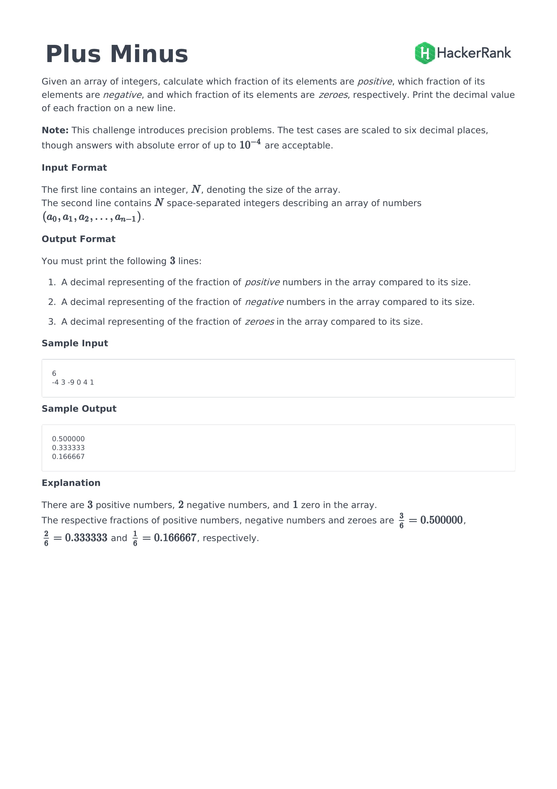

### answer

```python
def plusMinus(n, arr):
    positive = 0
    negative = 0
    zero = 0
    for i in arr:
        if i > 0:
            positive += 1
        elif i < 0:
            negative += 1
        else:
            zero += 1
    print(format(positive/n, '.6f'), format(negative/n, '.6f') ,format(zero/n, '.6f'), sep='\n')
```

1. python의 실수 표현 방법
    결국 컴퓨터는 하드웨어적인 한계가 있기 때문에 실수를 표현하는 것은 근사값으로 표시할 수 밖에는 없다는 이야기
    파이썬도 실제로 값은 딱 떨어저 나올지라도 내부적으로는 근사값으로 표현 된다는 것을 알고 있어야 한다.
    문서에서 [링크](https://docs.python.org/3/tutorial/floatingpoint.html)

2. format()메서드를 활용해 실수의 자릿수 표현하기
    아래와 같이 format()메서드를 활용하여 자릿수를 표현할 수 있다.
    ```python
    >>> format(math.pi, '.12g')  # give 12 significant digits
    '3.14159265359'
    
    >>> format(math.pi, '.2f')   # give 2 digits after the point
    '3.14'
    
    >>> repr(math.pi)
    '3.141592653589793'
    ```
    위의 예문은 python 문서에 나온 것 이다.
    format()메서드를 잘 활용할 수 있는 방법을 소개한 페이지가 있어서 참고로 남겨놓겠다.
    [https://pyformat.info/](https://pyformat.info/)
    
3. print()에서 줄바꿈 할 때 `sep='\n`활용하기
    print()를 활용할 때 보통 `\n`개행문자를 사용해서 직접 문자열을 사이에 넣어주는 방법을 섰었는데
    파이썬 코딩도장에 seq라는 키워드 인자에 값을 할당해서 각각의 요소들 사이에 넣어줄 수 있는 방법을 발견했다.
    여러번 쓸걸 한번에 해결할 수 있다는 점에서 기억해 두면 좋을 것 같다 아래는 코딩도장에 나와있는 예시문
    ```python
    >>> print(1, 2, 3, sep='\n')
    1 # ← 다음 줄로 이동
    2 # 2는 새 줄에서 시작, \n은 다음 줄로 이동
    3 # ← 새 줄에서 시작
    ```
    [코딩도장 링크](https://dojang.io/mod/page/view.php?id=855)